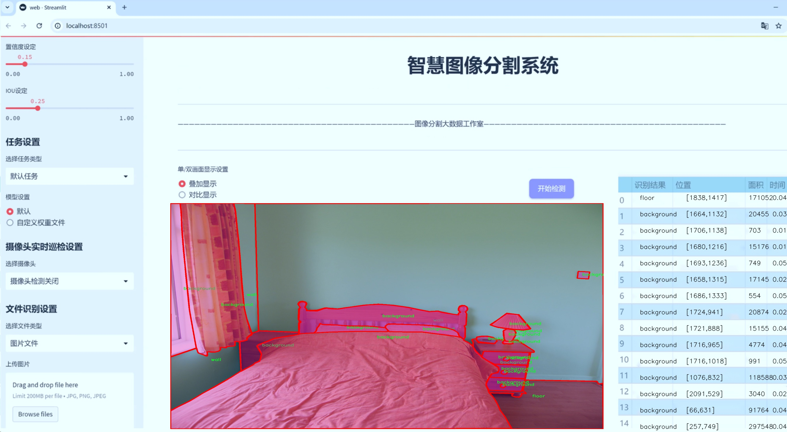
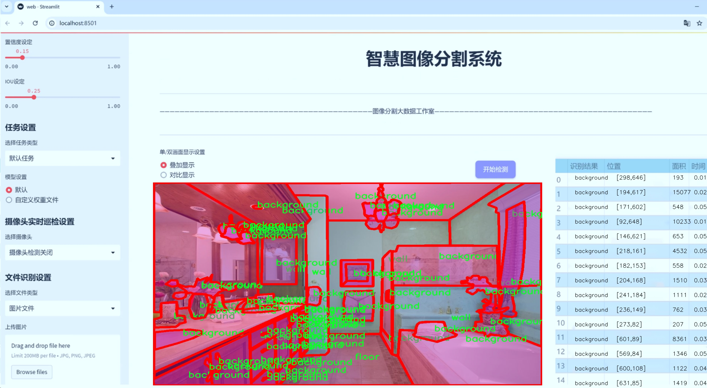
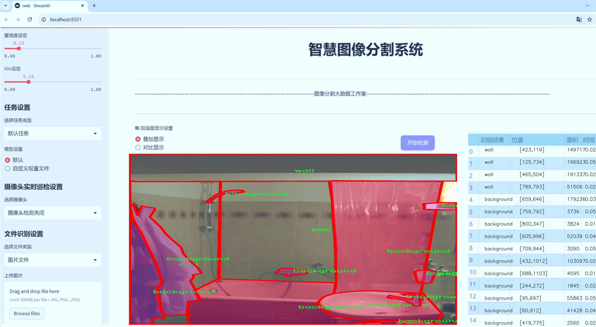
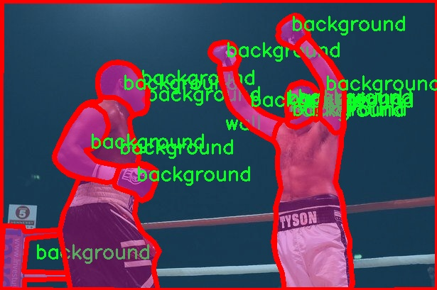
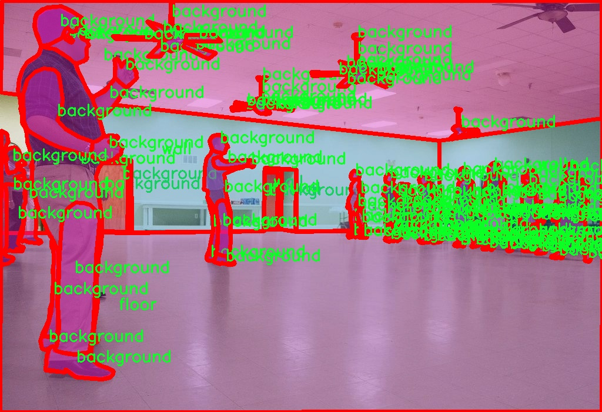
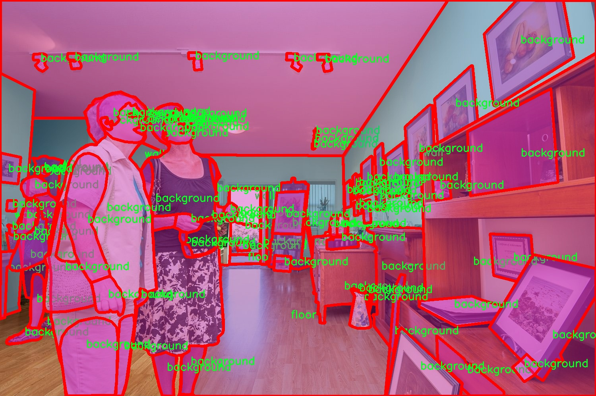
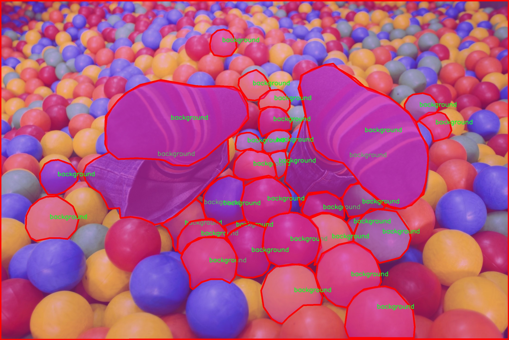
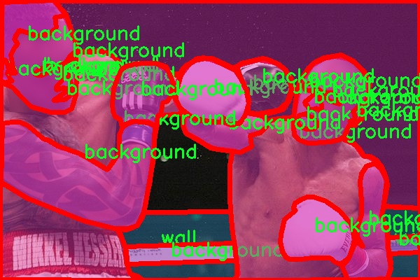

# 室内场景建筑构成和常见物品识别图像分割系统源码＆数据集分享
 [yolov8-seg-p6＆yolov8-seg-fasternet等50+全套改进创新点发刊_一键训练教程_Web前端展示]

### 1.研究背景与意义

项目参考[ILSVRC ImageNet Large Scale Visual Recognition Challenge](https://gitee.com/YOLOv8_YOLOv11_Segmentation_Studio/projects)

项目来源[AAAI Global Al lnnovation Contest](https://kdocs.cn/l/cszuIiCKVNis)

研究背景与意义

随着人工智能技术的迅猛发展，计算机视觉在各个领域的应用日益广泛，尤其是在室内场景理解和物体识别方面。室内环境的复杂性和多样性使得传统的图像处理技术难以满足实际需求，因此，基于深度学习的图像分割技术逐渐成为研究的热点。YOLO（You Only Look Once）系列模型以其高效的实时检测能力和较高的准确率，在目标检测和图像分割领域得到了广泛应用。特别是YOLOv8作为最新版本，进一步提升了模型的性能，具备了更强的特征提取和处理能力，为室内场景的建筑构成和常见物品识别提供了新的可能性。

在室内场景的图像分割任务中，墙壁和地板作为基本构成元素，扮演着重要的角色。通过对这些元素的准确识别与分割，不仅可以帮助计算机更好地理解室内环境，还可以为后续的智能家居、虚拟现实和增强现实等应用提供基础数据支持。针对特定的室内场景，构建一个基于改进YOLOv8的图像分割系统，能够有效提升识别精度和处理速度，从而满足实时应用的需求。

本研究所使用的数据集包含5400张图像，涵盖了三类主要元素：背景、地板和墙壁。这一数据集的构建为模型的训练和验证提供了丰富的样本，能够有效地提高模型的泛化能力。通过对这些类别的细致划分，研究者可以深入分析不同室内环境中墙壁和地板的特征，从而为模型的改进提供数据支持。尤其是在复杂的室内环境中，背景的多样性和地板、墙壁的不同材质、颜色和纹理特征，都会对图像分割的效果产生显著影响。因此，如何利用YOLOv8的优势，针对这些特征进行优化，将是本研究的重要任务。

此外，室内场景的建筑构成和常见物品识别不仅对智能家居系统的设计与实现具有重要意义，也为室内导航、空间布局优化、环境监测等应用提供了理论基础和技术支持。通过对室内环境的深入理解，能够推动智能建筑、智慧城市等领域的发展，提升人们的生活质量和工作效率。

综上所述，基于改进YOLOv8的室内场景建筑构成和常见物品识别图像分割系统的研究，不仅具有重要的学术价值，还具有广泛的应用前景。通过本研究的开展，期望能够为室内场景理解提供新的思路和方法，推动相关领域的技术进步，为未来的智能化生活奠定基础。

### 2.图片演示







##### 注意：由于此博客编辑较早，上面“2.图片演示”和“3.视频演示”展示的系统图片或者视频可能为老版本，新版本在老版本的基础上升级如下：（实际效果以升级的新版本为准）

  （1）适配了YOLOV8的“目标检测”模型和“实例分割”模型，通过加载相应的权重（.pt）文件即可自适应加载模型。

  （2）支持“图片识别”、“视频识别”、“摄像头实时识别”三种识别模式。

  （3）支持“图片识别”、“视频识别”、“摄像头实时识别”三种识别结果保存导出，解决手动导出（容易卡顿出现爆内存）存在的问题，识别完自动保存结果并导出到tempDir中。

  （4）支持Web前端系统中的标题、背景图等自定义修改，后面提供修改教程。

  另外本项目提供训练的数据集和训练教程,暂不提供权重文件（best.pt）,需要您按照教程进行训练后实现图片演示和Web前端界面演示的效果。

### 3.视频演示

[3.1 视频演示](https://www.bilibili.com/video/BV136SCYuE2h/)

### 4.数据集信息展示

##### 4.1 本项目数据集详细数据（类别数＆类别名）

nc: 3
names: ['background', 'floor', 'wall']


##### 4.2 本项目数据集信息介绍

数据集信息展示

在本研究中，我们使用了名为“wall-floor”的数据集，旨在改进YOLOv8-seg模型在室内场景中的建筑构成和常见物品识别图像分割能力。该数据集专注于室内环境的细节，通过对不同类别的物体进行标注，提供了丰富的训练素材，以便模型能够准确识别和分割出背景、地面和墙壁等关键元素。

“wall-floor”数据集包含三种主要类别，分别是“background”（背景）、“floor”（地面）和“wall”（墙壁）。这些类别的选择反映了室内场景中最基本的构成要素，能够有效地帮助模型理解和解析室内环境的结构。背景类别涵盖了室内空间中不属于主要物体的部分，例如家具、装饰品或其他附属物体，这些元素虽然不直接参与主要的分割任务，但在实际应用中，它们的存在和识别对于提高模型的准确性和实用性至关重要。地面类别则专注于室内的地面表面，无论是木地板、瓷砖还是地毯，这些不同的地面材料在视觉上具有显著的差异性，因此在训练过程中，模型需要学习如何区分和识别这些不同的地面类型。墙壁类别则代表了室内空间的垂直面，通常是房间的边界，墙壁的颜色、纹理和装饰也会影响模型的识别能力。

该数据集的构建考虑到了多样性和复杂性，确保了在不同的室内环境中都能有效地进行训练。数据集中包含了多种不同的室内场景，例如客厅、卧室、厨房和办公室等，每种场景都提供了丰富的图像样本。这些样本不仅包括不同的光照条件和视角，还涵盖了各种家具和装饰物品的摆放方式，使得模型在训练过程中能够接触到更为广泛的场景变化。这种多样性使得模型在实际应用中能够更好地适应不同的室内环境，提高了其泛化能力。

为了确保数据集的质量和标注的准确性，所有图像均经过严格的审查和标注过程。每一张图像都经过专业人员的手动标注，确保每个类别的边界清晰且准确。这种高质量的标注为模型的训练提供了坚实的基础，使得YOLOv8-seg能够在进行图像分割时，准确地识别出各个类别的区域，从而实现更为精细的分割效果。

综上所述，“wall-floor”数据集不仅为改进YOLOv8-seg模型提供了丰富的训练素材，还通过其多样性和高质量的标注，确保了模型在室内场景建筑构成和常见物品识别方面的有效性和准确性。随着深度学习技术的不断发展，该数据集的应用将为室内环境的智能识别和理解提供重要的支持，推动相关领域的研究和应用进程。











### 5.全套项目环境部署视频教程（零基础手把手教学）

[5.1 环境部署教程链接（零基础手把手教学）](https://www.bilibili.com/video/BV1jG4Ve4E9t/?vd_source=bc9aec86d164b67a7004b996143742dc)


[5.2 安装Python虚拟环境创建和依赖库安装视频教程链接（零基础手把手教学）](https://www.bilibili.com/video/BV1nA4VeYEze/?vd_source=bc9aec86d164b67a7004b996143742dc)

### 6.手把手YOLOV8-seg训练视频教程（零基础小白有手就能学会）

[6.1 手把手YOLOV8-seg训练视频教程（零基础小白有手就能学会）](https://www.bilibili.com/video/BV1cA4VeYETe/?vd_source=bc9aec86d164b67a7004b996143742dc)


按照上面的训练视频教程链接加载项目提供的数据集，运行train.py即可开始训练



     Epoch   gpu_mem       box       obj       cls    labels  img_size
     1/200     0G   0.01576   0.01955  0.007536        22      1280: 100%|██████████| 849/849 [14:42<00:00,  1.04s/it]
               Class     Images     Labels          P          R     mAP@.5 mAP@.5:.95: 100%|██████████| 213/213 [01:14<00:00,  2.87it/s]
                 all       3395      17314      0.994      0.957      0.0957      0.0843

     Epoch   gpu_mem       box       obj       cls    labels  img_size
     2/200     0G   0.01578   0.01923  0.007006        22      1280: 100%|██████████| 849/849 [14:44<00:00,  1.04s/it]
               Class     Images     Labels          P          R     mAP@.5 mAP@.5:.95: 100%|██████████| 213/213 [01:12<00:00,  2.95it/s]
                 all       3395      17314      0.996      0.956      0.0957      0.0845

     Epoch   gpu_mem       box       obj       cls    labels  img_size
     3/200     0G   0.01561    0.0191  0.006895        27      1280: 100%|██████████| 849/849 [10:56<00:00,  1.29it/s]
               Class     Images     Labels          P          R     mAP@.5 mAP@.5:.95: 100%|███████   | 187/213 [00:52<00:00,  4.04it/s]
                 all       3395      17314      0.996      0.957      0.0957      0.0845


### 7.50+种全套YOLOV8-seg创新点代码加载调参视频教程（一键加载写好的改进模型的配置文件）

[7.1 50+种全套YOLOV8-seg创新点代码加载调参视频教程（一键加载写好的改进模型的配置文件）](https://www.bilibili.com/video/BV1Hw4VePEXv/?vd_source=bc9aec86d164b67a7004b996143742dc)

### 8.YOLOV8-seg图像分割算法原理

原始YOLOv8-seg算法原理

YOLOv8-seg算法是YOLO系列中的最新一代目标检测与分割算法，基于YOLOv8的框架，结合了先进的深度学习技术和特征提取方法，旨在实现高效、准确的目标检测与分割。该算法的设计理念是通过优化网络结构和引入新的技术，提升模型在复杂场景下的表现。YOLOv8-seg的架构仍然遵循YOLO系列一贯的设计原则，采用输入层、主干网络、特征融合层和解耦头的结构。

在主干网络部分，YOLOv8-seg依然延续了YOLOv5的CSPDarknet思想，但进行了重要的改进。C3模块被替换为C2f模块，后者引入了ELAN（Efficient Layer Aggregation Network）思想，通过增加跳层连接来增强特征的流动性和梯度的传播。这种设计不仅实现了模型的轻量化，同时也确保了检测精度的提升。C2f模块由多个CBS（卷积+归一化+SiLU激活）模块和Bottleneck结构组成，通过并行和串联的方式有效地提取多层次特征，增强了模型对细节信息的捕捉能力。

特征融合层采用了PAN-FPN（Path Aggregation Network - Feature Pyramid Network）结构，旨在实现多尺度特征的有效融合。YOLOv8-seg在这一部分的设计上，去除了YOLOv5中的某些卷积层，直接进行上采样并与中层特征进行拼接，进一步提高了特征融合的效率。通过自下而上的融合过程，模型能够更好地结合高层的语义信息与低层的细节信息，从而在目标检测和分割任务中取得更优的效果。

在解耦头部分，YOLOv8-seg采用了Anchor-Free的设计理念，抛弃了传统的Anchor-Base方法，直接预测目标的中心位置。这一创新使得模型在处理小目标和密集目标时表现得更加灵活和高效。解耦头分为分类和回归两个分支，分别针对目标的类别和位置进行预测。通过引入Distribution Focal Loss和CIoU Loss等新的损失函数，YOLOv8-seg能够更好地处理样本不平衡和难以分类的目标，提升了模型的收敛速度和准确性。

在数据预处理阶段，YOLOv8-seg使用了YOLOv5的增强策略，包括马赛克增强、混合增强、空间扰动和颜色扰动等手段。这些数据增强技术有助于提升模型的鲁棒性和泛化能力，使其在面对不同场景和光照条件时仍能保持良好的检测性能。然而，YOLOv8-seg在训练的最后阶段停止使用马赛克增强，以避免对数据分布的干扰，确保模型学习到更真实的特征。

YOLOv8-seg在样本匹配策略上进行了创新，采用了Task-Aligned的Assigner匹配方式，旨在提高正负样本的匹配效率。这一策略通过对分类分数和IoU的高次幂乘积进行结合，优化了正负样本的选择，使得模型在训练过程中能够更好地聚焦于难以分类的样本，从而提升整体的检测精度。

值得一提的是，YOLOv8-seg在目标分割方面也做出了重要的改进。通过引入分割头，模型能够在进行目标检测的同时，输出目标的精确分割掩码。这一功能对于许多实际应用场景，如自动驾驶、医学影像分析等，具有重要的意义。分割头的设计与解耦头相辅相成，使得模型在目标定位和分割任务中能够相互促进，提升整体性能。

综上所述，YOLOv8-seg算法在YOLO系列的基础上，结合了多项先进的技术和设计理念，旨在实现高效、准确的目标检测与分割。通过优化网络结构、引入新的损失函数和样本匹配策略，YOLOv8-seg不仅提升了模型的检测精度，也增强了其在复杂场景下的适应能力。随着YOLOv8-seg的推出，目标检测与分割领域的研究和应用将迎来新的机遇与挑战。


### 9.系统功能展示（检测对象为举例，实际内容以本项目数据集为准）

图9.1.系统支持检测结果表格显示

  图9.2.系统支持置信度和IOU阈值手动调节

  图9.3.系统支持自定义加载权重文件best.pt(需要你通过步骤5中训练获得)

  图9.4.系统支持摄像头实时识别

  图9.5.系统支持图片识别

  图9.6.系统支持视频识别

  图9.7.系统支持识别结果文件自动保存

  图9.8.系统支持Excel导出检测结果数据


### 10.50+种全套YOLOV8-seg创新点原理讲解（非科班也可以轻松写刊发刊，V11版本正在科研待更新）

#### 10.1 由于篇幅限制，每个创新点的具体原理讲解就不一一展开，具体见下列网址中的创新点对应子项目的技术原理博客网址【Blog】：


[10.1 50+种全套YOLOV8-seg创新点原理讲解链接](https://gitee.com/qunmasj/good)

#### 10.2 部分改进模块原理讲解(完整的改进原理见上图和技术博客链接)【如果此小节的图加载失败可以通过CSDN或者Github搜索该博客的标题访问原始博客，原始博客图片显示正常】
### YOLOv8简介
YOLOv8目标检测算法继承了YOLOv1 系列的思考,是一种新型端到端的目标检测算法,尽管现在原始检测算法已经开源,但是鲜有发表的相关论文.YOLOv8的网络结构如图1[1所示,主要可分为Input输入端、Backbone 骨干神经网络、Neck混合特征网络层和 Head预测层网络共4个部分.

输入端( input)方法包含的功能模块有:马赛克( mosaic)数据增强、自适应锚框( anchor)计算、自适应图片缩放和 Mixup 数据增强['6].马赛克数据增强包括3种方式:缩放,色彩空间调整和马赛克增强.
该方法通过将4张图像进行随机的缩放﹑裁剪和打乱分布方式等操作来重新拼接图像,可丰富检测的数据集,具体步骤可见图2.随机缩放增加的许多小目标,非常适于解决卫星数据往往因距离目标过远从而导致图像中几乎都是小目标这一问题.在自适应锚框计算中, YOLO算法在每次训练数据之前,都会根据标注信息自动计算该数据集最合适的锚框尺寸,然后自动匹配最佳锚框.而自适应图片缩放只在检测时使用,由于不同场景需求不同,因而基于缩放系数YOLOv8提供了多尺度的不同大小模型.Mixup 数据增强鼓励模型对训练样本有一个线性的理解,具体做法是在目标检测中将两幅图像的像素值按照图像透明度的通道信息( alpha值)进行线性融合,对于标签box的处理直接采用拼接( con-cat)的方法拼接到一起.


Backbone骨干网络指用来提取图像特征的网络,整体结构包括注意力机制( focus)模块、跨阶段局部网络[ 7] ( cross stage partial network , CSP)和空间金字塔池化结构( spatial pyramid pooling,SPP).其中, Focus模块的作用是在图片进入 Backbone骨干网络前,对图片进行切片操作,即在一张图片中每隔一个像素取一个值,获得4张互补的图片,最后将新生成的图片经过卷积操作,得到没有信息丢失的2倍下采样特征图.YOLOv8使用了CSPNet 中的C2f网络,网络见图3,其中 CBS 就是卷积层,而瓶颈层( bottleneck layer)使用的是1* 1的卷积神经网络.C2f网络在保证轻量化的同时获得更加丰富的梯度流信息.而SPP结构是空间金字塔池化,能将任意大小的特征图转换成固定大小的特征向量,即把输入的特征地图划分为多个尺度,然后对每个图进行最大池化,再将提取的特征值拼接起来成为一维向量,输入SPP层获取分类.


Neck 结构如图4所示,它是由卷积层和C2f模块组成的的网络层,采用了路径聚合网络( path ag-gregation network ,PAN)和特征金字塔网络( featurepyramid networks , FPN)的结构对特征进行多尺度融合,目标是将图像特征传递到预测层.其中 PAN结构指图4左半边,它自底向上进行下采样,使顶层特征包含图像位置信息,两个特征最后进行融合,使不同尺寸的特征图都包含图像语义信息和图像特征信息，保证了网络对不同尺寸的图片的准确预测.而FPN结构指图4右半边,指通过自顶向下进行上采样,将高层特征与底层特征进行融合,从而同时利用低层特征的高分辨率和高层特征的丰富语义信息,并进行了多尺度特征的独立预测,对小物体的检测效果有明显的提升.从 FPN模块的基础上看,它增加了自底向上的特征金字塔结构,保留了更多的浅层位置特征,将整体特征提取能力进一步提升.


Head的结构如图5所示,在该结构中 YOLOv8采用了解耦检测头( decoupled-head )[ 18],因为分类和定位的关注点不同,分类更关注目标的纹理内容而定位更关注目标的边缘信息.因而解耦头结构考虑到分类和定位所关注的内容的不同,采用不同的分支来进行运算,提升了检测效果,相对应的回归头的通道数也改变了.


### MS-Block简介
实时目标检测，以YOLO系列为例，已在工业领域中找到重要应用，特别是在边缘设备（如无人机和机器人）中。与之前的目标检测器不同，实时目标检测器旨在在速度和准确性之间追求最佳平衡。为了实现这一目标，提出了大量的工作：从第一代DarkNet到CSPNet，再到最近的扩展ELAN，随着性能的快速增长，实时目标检测器的架构经历了巨大的变化。

尽管性能令人印象深刻，但在不同尺度上识别对象仍然是实时目标检测器面临的基本挑战。这促使作者设计了一个强大的编码器架构，用于学习具有表现力的多尺度特征表示。具体而言，作者从两个新的角度考虑为实时目标检测编码多尺度特征：

从局部视角出发，作者设计了一个具有简单而有效的分层特征融合策略的MS-Block。受到Res2Net的启发，作者在MS-Block中引入了多个分支来进行特征提取，但不同的是，作者使用了一个带有深度卷积的 Inverted Bottleneck Block块，以实现对大Kernel的高效利用。

从全局视角出发，作者提出随着网络加深逐渐增加卷积的Kernel-Size。作者在浅层使用小Kernel卷积来更高效地处理高分辨率特征。另一方面，在深层中，作者采用大Kernel卷积来捕捉广泛的信息。

基于以上设计原则，作者呈现了作者的实时目标检测器，称为YOLO-MS。为了评估作者的YOLO-MS的性能，作者在MS COCO数据集上进行了全面的实验。还提供了与其他最先进方法的定量比较，以展示作者方法的强大性能。如图1所示，YOLO-MS在计算性能平衡方面优于其他近期的实时目标检测器。


具体而言，YOLO-MS-XS在MS COCO上获得了43%+的AP得分，仅具有450万个可学习参数和8.7亿个FLOPs。YOLO-MS-S和YOLO-MS分别获得了46%+和51%+的AP，可学习参数分别为810万和2220万。此外，作者的工作还可以作为其他YOLO模型的即插即用模块。通常情况下，作者的方法可以将YOLOv8的AP从37%+显著提高到40%+，甚至还可以使用更少的参数和FLOPs。

CSP Block是一个基于阶段级梯度路径的网络，平衡了梯度组合和计算成本。它是广泛应用于YOLO系列的基本构建块。已经提出了几种变体，包括YOLOv4和YOLOv5中的原始版本，Scaled YOLOv4中的CSPVoVNet，YOLOv7中的ELAN，以及RTMDet中提出的大Kernel单元。作者在图2(a)和图2(b)中分别展示了原始CSP块和ELAN的结构。


上述实时检测器中被忽视的一个关键方面是如何在基本构建块中编码多尺度特征。其中一个强大的设计原则是Res2Net，它聚合了来自不同层次的特征以增强多尺度表示。然而，这一原则并没有充分探索大Kernel卷积的作用，而大Kernel卷积已经在基于CNN的视觉识别任务模型中证明有效。将大Kernel卷积纳入Res2Net的主要障碍在于它们引入的计算开销，因为构建块采用了标准卷积。在作者的方法中，作者提出用 Inverted Bottleneck Block替代标准的3 × 3卷积，以享受大Kernel卷积的好处。

#### MS-Block

基于前面的分析，参考该博客提出了一个带有分层特征融合策略的全新Block，称为MS-Block，以增强实时目标检测器在提取多尺度特征时的能力，同时保持快速的推理速度。

MS-Block的具体结构如图2(c)所示。假设是输入特征。通过1×1卷积的转换后，X的通道维度增加到n*C。然后，作者将X分割成n个不同的组，表示为，其中。为了降低计算成本，作者选择n为3。

注意，除了之外，每个其他组都经过一个 Inverted Bottleneck Block层，用表示，其中k表示Kernel-Size，以获得。的数学表示如下：


根据这个公式，作者不将 Inverted Bottleneck Block层连接到，使其作为跨阶段连接，并保留来自前面层的信息。最后，作者将所有分割连接在一起，并应用1×1卷积来在所有分割之间进行交互，每个分割都编码不同尺度的特征。当网络加深时，这个1×1卷积也用于调整通道数。

#### Heterogeneous Kernel Selection Protocol
除了构建块的设计外，作者还从宏观角度探讨了卷积的使用。之前的实时目标检测器在不同的编码器阶段采用了同质卷积（即具有相同Kernel-Size的卷积），但作者认为这不是提取多尺度语义信息的最佳选项。

在金字塔结构中，从检测器的浅阶段提取的高分辨率特征通常用于捕捉细粒度语义，将用于检测小目标。相反，来自网络较深阶段的低分辨率特征用于捕捉高级语义，将用于检测大目标。如果作者在所有阶段都采用统一的小Kernel卷积，深阶段的有效感受野（ERF）将受到限制，影响大目标的性能。在每个阶段中引入大Kernel卷积可以帮助解决这个问题。然而，具有大的ERF的大Kernel可以编码更广泛的区域，这增加了在小目标外部包含噪声信息的概率，并且降低了推理速度。

在这项工作中，作者建议在不同阶段中采用异构卷积，以帮助捕获更丰富的多尺度特征。具体来说，在编码器的第一个阶段中，作者采用最小Kernel卷积，而最大Kernel卷积位于最后一个阶段。随后，作者逐步增加中间阶段的Kernel-Size，使其与特征分辨率的增加保持一致。这种策略允许提取细粒度和粗粒度的语义信息，增强了编码器的多尺度特征表示能力。

正如图所示，作者将k的值分别分配给编码器中的浅阶段到深阶段，取值为3、5、7和9。作者将其称为异构Kernel选择（HKS）协议。


作者的HKS协议能够在深层中扩大感受野，而不会对浅层产生任何其他影响。第4节的图4支持了作者的分析。此外，HKS不仅有助于编码更丰富的多尺度特征，还确保了高效的推理。

如表1所示，将大Kernel卷积应用于高分辨率特征会产生较高的计算开销。然而，作者的HKS协议在低分辨率特征上采用大Kernel卷积，从而与仅使用大Kernel卷积相比，大大降低了计算成本。


在实践中，作者经验性地发现，采用HKS协议的YOLO-MS的推理速度几乎与仅使用深度可分离的3 × 3卷积相同。


如图所示，作者模型的Backbone由4个阶段组成，每个阶段后面跟随1个步长为2的3 × 3卷积进行下采样。在第3个阶段后，作者添加了1个SPP块，与RTMDet中一样。在作者的编码器上，作者使用PAFPN作为Neck来构建特征金字塔[31, 35]。它融合了从Backbone不同阶段提取的多尺度特征。Neck中使用的基本构建块也是作者的MS-Block，在其中使用3 × 3深度可分离卷积进行快速推理。

此外，为了在速度和准确性之间取得更好的平衡，作者将Backbone中多级特征的通道深度减半。作者提供了3个不同尺度的YOLO-MS变体，即YOLO-MS-XS、YOLO-MS-S和YOLO-MS。不同尺度的YOLO-MS的详细配置列在表2中。对于YOLO-MS的其他部分，作者将其保持与RTMDet相同。


### 11.项目核心源码讲解（再也不用担心看不懂代码逻辑）

#### 11.1 ultralytics\models\sam\modules\transformer.py

以下是经过简化和注释的核心代码，保留了最重要的部分，以便于理解和使用。

```python
import math
from typing import Tuple, Type
import torch
from torch import Tensor, nn
from ultralytics.nn.modules import MLPBlock

class TwoWayTransformer(nn.Module):
    """
    双向变换器模块，能够同时关注图像和查询点。该类作为一个专门的变换器解码器，使用提供的查询位置嵌入来关注输入图像。
    适用于目标检测、图像分割和点云处理等任务。
    """

    def __init__(self, depth: int, embedding_dim: int, num_heads: int, mlp_dim: int, activation: Type[nn.Module] = nn.ReLU) -> None:
        """
        初始化双向变换器。

        Args:
          depth (int): 变换器的层数
          embedding_dim (int): 输入嵌入的通道维度
          num_heads (int): 多头注意力的头数
          mlp_dim (int): MLP块的内部通道维度
        """
        super().__init__()
        self.depth = depth
        self.layers = nn.ModuleList()

        # 添加多个双向注意力块
        for i in range(depth):
            self.layers.append(TwoWayAttentionBlock(embedding_dim, num_heads, mlp_dim, activation))

        # 最终的注意力层和归一化层
        self.final_attn_token_to_image = Attention(embedding_dim, num_heads)
        self.norm_final_attn = nn.LayerNorm(embedding_dim)

    def forward(self, image_embedding: Tensor, point_embedding: Tensor) -> Tuple[Tensor, Tensor]:
        """
        前向传播函数。

        Args:
          image_embedding (Tensor): 输入图像的嵌入
          point_embedding (Tensor): 查询点的嵌入

        Returns:
          Tuple[Tensor, Tensor]: 处理后的查询点嵌入和图像嵌入
        """
        # 将图像嵌入展平并转置
        image_embedding = image_embedding.flatten(2).permute(0, 2, 1)

        # 准备查询和键
        queries = point_embedding
        keys = image_embedding

        # 通过每个变换器层
        for layer in self.layers:
            queries, keys = layer(queries, keys)

        # 最终的注意力层
        attn_out = self.final_attn_token_to_image(q=queries, k=keys, v=keys)
        queries = self.norm_final_attn(queries + attn_out)

        return queries, keys


class TwoWayAttentionBlock(nn.Module):
    """
    一个注意力块，执行自注意力和交叉注意力。包括自注意力、交叉注意力、MLP块等。
    """

    def __init__(self, embedding_dim: int, num_heads: int, mlp_dim: int = 2048, activation: Type[nn.Module] = nn.ReLU) -> None:
        """
        初始化双向注意力块。

        Args:
          embedding_dim (int): 嵌入的通道维度
          num_heads (int): 注意力层的头数
          mlp_dim (int): MLP块的隐藏维度
        """
        super().__init__()
        self.self_attn = Attention(embedding_dim, num_heads)
        self.cross_attn_token_to_image = Attention(embedding_dim, num_heads)
        self.mlp = MLPBlock(embedding_dim, mlp_dim, activation)

    def forward(self, queries: Tensor, keys: Tensor) -> Tuple[Tensor, Tensor]:
        """应用自注意力和交叉注意力，并返回处理后的嵌入。"""

        # 自注意力
        attn_out = self.self_attn(q=queries, k=queries, v=queries)
        queries = queries + attn_out

        # 交叉注意力
        attn_out = self.cross_attn_token_to_image(q=queries, k=keys, v=keys)
        queries = queries + attn_out

        # MLP块
        mlp_out = self.mlp(queries)
        queries = queries + mlp_out

        return queries, keys


class Attention(nn.Module):
    """注意力层，允许在投影到查询、键和值后缩小嵌入的大小。"""

    def __init__(self, embedding_dim: int, num_heads: int) -> None:
        """
        初始化注意力模型。

        Args:
            embedding_dim (int): 输入嵌入的维度。
            num_heads (int): 注意力头的数量。
        """
        super().__init__()
        self.q_proj = nn.Linear(embedding_dim, embedding_dim)
        self.k_proj = nn.Linear(embedding_dim, embedding_dim)
        self.v_proj = nn.Linear(embedding_dim, embedding_dim)

    def forward(self, q: Tensor, k: Tensor, v: Tensor) -> Tensor:
        """计算给定输入查询、键和值张量的注意力输出。"""

        # 输入投影
        q = self.q_proj(q)
        k = self.k_proj(k)
        v = self.v_proj(v)

        # 计算注意力
        attn = torch.softmax(q @ k.transpose(-2, -1) / math.sqrt(k.size(-1)), dim=-1)
        return attn @ v
```

### 代码注释说明
1. **TwoWayTransformer**: 这是一个双向变换器，能够同时处理图像和查询点的嵌入。它包含多个层，每层是一个双向注意力块。
2. **TwoWayAttentionBlock**: 这个类实现了自注意力和交叉注意力的功能，能够处理查询和键的交互。
3. **Attention**: 这是一个基本的注意力层，负责将输入的查询、键和值进行投影，并计算注意力输出。

该代码实现了一个双向变换器的核心结构，适用于多种计算机视觉任务。

这个文件定义了一个名为 `TwoWayTransformer` 的类，主要用于实现一个双向变换器（Transformer）模块，能够同时关注图像和查询点。这个类特别适用于物体检测、图像分割和点云处理等任务。

在 `TwoWayTransformer` 类的构造函数中，初始化了一些关键参数，包括变换器的层数（`depth`）、输入嵌入的通道维度（`embedding_dim`）、多头注意力的头数（`num_heads`）、MLP块的内部通道维度（`mlp_dim`）以及激活函数等。构造函数中还创建了多个 `TwoWayAttentionBlock` 层，这些层将构成变换器的主体。

`forward` 方法是该类的前向传播函数，接收图像嵌入、图像的位置信息编码（`image_pe`）和查询点的嵌入。首先，将图像嵌入和位置信息编码展平并重新排列形状，以便后续处理。然后，准备查询和键的输入，依次通过每个 `TwoWayAttentionBlock` 层进行处理。最后，应用一个最终的注意力层，将查询点与图像进行交互，并对结果进行层归一化。

`TwoWayAttentionBlock` 类实现了一个注意力块，执行自注意力和交叉注意力，支持双向的信息流动。它包含四个主要部分：对稀疏输入的自注意力、稀疏输入到密集输入的交叉注意力、对稀疏输入的MLP块处理，以及密集输入到稀疏输入的交叉注意力。构造函数中定义了这些层的结构和顺序。

在 `TwoWayAttentionBlock` 的 `forward` 方法中，首先进行自注意力处理，然后是稀疏输入与密集输入之间的交叉注意力，接着通过MLP块处理查询，最后进行密集输入与稀疏输入之间的交叉注意力。每一步之后都进行了层归一化，以确保稳定性和加速收敛。

`Attention` 类则实现了一个基本的注意力机制，允许在投影到查询、键和值之后对嵌入进行下采样。它的构造函数初始化了输入嵌入的维度、注意力头的数量以及下采样率。`forward` 方法计算给定查询、键和值的注意力输出，首先对输入进行线性投影，然后将其分离为多个注意力头，计算注意力分数，并最终组合输出。

整体而言，这个文件实现了一个复杂的双向变换器结构，能够有效地处理图像和查询点之间的交互，为计算机视觉任务提供了强大的支持。

#### 11.2 ultralytics\nn\extra_modules\ops_dcnv3\test.py

以下是代码中最核心的部分，并附上详细的中文注释：

```python
import torch
from functions.dcnv3_func import DCNv3Function, dcnv3_core_pytorch

# 输入和输出的尺寸
H_in, W_in = 8, 8  # 输入的高度和宽度
N, M, D = 2, 4, 16  # N: 批量大小, M: 输出通道数, D: 特征维度
Kh, Kw = 3, 3  # 卷积核的高度和宽度
remove_center = False  # 是否移除中心点
P = Kh * Kw - remove_center  # 每个卷积核的有效点数
offset_scale = 2.0  # 偏移量的缩放因子
pad = 1  # 填充大小
dilation = 1  # 膨胀系数
stride = 1  # 步幅
# 计算输出的高度和宽度
H_out = (H_in + 2 * pad - (dilation * (Kh - 1) + 1)) // stride + 1
W_out = (W_in + 2 * pad - (dilation * (Kw - 1) + 1)) // stride + 1

torch.manual_seed(3)  # 设置随机种子

@torch.no_grad()
def check_forward_equal_with_pytorch_double():
    # 创建输入、偏移量和掩码
    input = torch.rand(N, H_in, W_in, M*D).cuda() * 0.01
    offset = torch.rand(N, H_out, W_out, M*P*2).cuda() * 10
    mask = torch.rand(N, H_out, W_out, M, P).cuda() + 1e-5
    mask /= mask.sum(-1, keepdim=True)  # 归一化掩码
    mask = mask.reshape(N, H_out, W_out, M*P)

    # 使用PyTorch的实现进行前向传播
    output_pytorch = dcnv3_core_pytorch(
        input.double(),
        offset.double(),
        mask.double(),
        Kh, Kw, stride, stride, Kh // 2, Kw // 2, dilation, dilation, M, D, offset_scale, remove_center).detach().cpu()

    # 使用自定义的DCNv3函数进行前向传播
    output_cuda = DCNv3Function.apply(
        input.double(),
        offset.double(),
        mask.double(),
        Kh, Kw, stride, stride, Kh // 2, Kw // 2, dilation, dilation, M, D, offset_scale,
        im2col_step=2, remove_center).detach().cpu()

    # 检查两个输出是否相近
    fwdok = torch.allclose(output_cuda, output_pytorch)
    max_abs_err = (output_cuda - output_pytorch).abs().max()  # 最大绝对误差
    max_rel_err = ((output_cuda - output_pytorch).abs() / output_pytorch.abs()).max()  # 最大相对误差
    print('>>> forward double')
    print(f'* {fwdok} check_forward_equal_with_pytorch_double: max_abs_err {max_abs_err:.2e} max_rel_err {max_rel_err:.2e}')

if __name__ == '__main__':
    check_forward_equal_with_pytorch_double()  # 调用前向传播检查函数
```

### 代码说明：
1. **输入输出参数设置**：定义了输入的高度、宽度、批量大小、输出通道数和特征维度等参数。
2. **前向传播检查函数**：`check_forward_equal_with_pytorch_double`函数用于比较自定义DCNv3实现与PyTorch标准实现的输出是否一致。
   - 创建随机输入、偏移量和掩码。
   - 使用PyTorch的核心函数和自定义DCNv3函数进行前向传播。
   - 比较两个输出的相似性，并计算最大绝对误差和相对误差。
3. **主程序**：在主程序中调用前向传播检查函数，确保代码的正确性。

通过这些核心部分和注释，可以更好地理解代码的功能和结构。

这个程序文件 `test.py` 是用于测试和验证 DCNv3（Deformable Convolutional Networks v3）功能的实现。该文件主要包含了几个函数，用于检查前向和反向传播的正确性，并测量运行时间。

首先，文件导入了一些必要的库，包括 PyTorch 和一些数学函数。接着，定义了一些参数，例如输入和输出的高度和宽度、卷积核的大小、填充、步幅等。这些参数用于构建输入数据和进行卷积操作。

程序中定义了多个函数：

1. `check_forward_equal_with_pytorch_double` 和 `check_forward_equal_with_pytorch_float`：这两个函数用于检查 DCNv3 的前向传播结果是否与 PyTorch 的实现相同。它们分别使用双精度和单精度浮点数生成随机输入、偏移量和掩码，然后调用自定义的 `dcnv3_core_pytorch` 函数和 `DCNv3Function.apply` 函数，比较它们的输出是否相近，并打印出最大绝对误差和相对误差。

2. `check_backward_equal_with_pytorch_double` 和 `check_backward_equal_with_pytorch_float`：这两个函数用于检查反向传播的梯度是否一致。它们与前向检查函数类似，但在计算输出后调用 `.backward()` 方法来计算梯度，并比较两个实现的梯度是否相近。

3. `check_time_cost`：该函数用于测量 DCNv3 前向传播的时间成本。它生成一定大小的输入数据，并在多次重复调用中计算平均时间。

最后，在 `__main__` 块中，程序依次调用前向和反向检查函数，验证不同通道数的梯度，并测量不同 `im2col_step` 值下的时间成本。

总体来说，这个测试脚本的目的是确保 DCNv3 的实现与 PyTorch 的标准实现相一致，并评估其性能。通过这些测试，开发者可以确认其实现的正确性和效率。

#### 11.3 ultralytics\utils\metrics.py

以下是代码中最核心的部分，并附上详细的中文注释：

```python
import numpy as np
import torch

def box_iou(box1, box2, eps=1e-7):
    """
    计算两个边界框之间的交并比（IoU）。
    
    参数：
        box1 (torch.Tensor): 形状为 (N, 4) 的张量，表示 N 个边界框。
        box2 (torch.Tensor): 形状为 (M, 4) 的张量，表示 M 个边界框。
        eps (float, optional): 避免除以零的小值，默认为 1e-7。

    返回：
        (torch.Tensor): 形状为 (N, M) 的张量，包含 box1 和 box2 中每对边界框的 IoU 值。
    """
    # 将 box1 和 box2 的坐标分解为左上角和右下角的坐标
    (a1, a2), (b1, b2) = box1.unsqueeze(1).chunk(2, 2), box2.unsqueeze(0).chunk(2, 2)
    
    # 计算交集区域
    inter = (torch.min(a2, b2) - torch.max(a1, b1)).clamp_(0).prod(2)

    # 计算 IoU = 交集 / (区域1 + 区域2 - 交集)
    return inter / ((a2 - a1).prod(2) + (b2 - b1).prod(2) - inter + eps)

def bbox_iou(box1, box2, xywh=True, eps=1e-7):
    """
    计算边界框 box1 (1, 4) 与 box2 (n, 4) 之间的交并比（IoU）。
    
    参数：
        box1 (torch.Tensor): 形状为 (1, 4) 的张量，表示单个边界框。
        box2 (torch.Tensor): 形状为 (n, 4) 的张量，表示 n 个边界框。
        xywh (bool, optional): 如果为 True，输入框为 (x, y, w, h) 格式；如果为 False，输入框为 (x1, y1, x2, y2) 格式。默认为 True。
        eps (float, optional): 避免除以零的小值，默认为 1e-7。

    返回：
        (torch.Tensor): 计算得到的 IoU 值。
    """
    # 获取边界框的坐标
    if xywh:  # 如果输入格式为 (x, y, w, h)，则转换为 (x1, y1, x2, y2)
        (x1, y1, w1, h1), (x2, y2, w2, h2) = box1.chunk(4, -1), box2.chunk(4, -1)
        b1_x1, b1_x2, b1_y1, b1_y2 = x1 - w1 / 2, x1 + w1 / 2, y1 - h1 / 2, y1 + h1 / 2
        b2_x1, b2_x2, b2_y1, b2_y2 = x2 - w2 / 2, x2 + w2 / 2, y2 - h2 / 2, y2 + h2 / 2
    else:  # 如果输入格式为 (x1, y1, x2, y2)
        b1_x1, b1_y1, b1_x2, b1_y2 = box1.chunk(4, -1)
        b2_x1, b2_y1, b2_x2, b2_y2 = box2.chunk(4, -1)

    # 计算交集区域
    inter = (b1_x2.minimum(b2_x2) - b1_x1.maximum(b2_x1)).clamp_(0) * \
            (b1_y2.minimum(b2_y2) - b1_y1.maximum(b2_y1)).clamp_(0)

    # 计算并集区域
    union = (b1_x2 - b1_x1) * (b1_y2 - b1_y1 + eps) + (b2_x2 - b2_x1) * (b2_y2 - b2_y1 + eps) - inter + eps

    # 返回 IoU 值
    return inter / union

def compute_ap(recall, precision):
    """
    计算给定召回率和精确率曲线的平均精度（AP）。
    
    参数：
        recall (list): 召回率曲线。
        precision (list): 精确率曲线。

    返回：
        (float): 平均精度。
        (np.ndarray): 精确率包络曲线。
        (np.ndarray): 修改后的召回率曲线，开头和结尾添加了哨兵值。
    """
    # 在开头和结尾添加哨兵值
    mrec = np.concatenate(([0.0], recall, [1.0]))
    mpre = np.concatenate(([1.0], precision, [0.0]))

    # 计算精确率包络
    mpre = np.flip(np.maximum.accumulate(np.flip(mpre)))

    # 计算曲线下面积
    x = np.linspace(0, 1, 101)  # 101 点插值（COCO）
    ap = np.trapz(np.interp(x, mrec, mpre), x)  # 积分

    return ap, mpre, mrec
```

### 代码说明
1. **box_iou**: 计算两个边界框之间的交并比（IoU），使用 PyTorch 张量进行计算。
2. **bbox_iou**: 计算单个边界框与多个边界框之间的 IoU，支持不同的输入格式（xywh 或 xyxy）。
3. **compute_ap**: 计算平均精度（AP），通过对召回率和精确率曲线进行插值和积分来实现。

这些函数是目标检测模型评估的核心部分，提供了计算边界框重叠程度和模型性能的重要指标。

这个程序文件是Ultralytics YOLO模型中的一个模块，主要用于计算模型验证指标。它包含了一系列用于评估目标检测和分类性能的函数和类。

首先，文件导入了一些必要的库，包括数学计算、警告处理、路径操作、绘图、NumPy和PyTorch等。接着定义了一些常量和函数，用于计算不同类型的指标，如交并比（IoU）、边界框的相似度等。

`bbox_ioa`函数计算给定两个边界框的交集与第二个框的面积的比值，支持返回标准的IoU或交集面积与第二个框面积的比值。`box_iou`函数则计算两个边界框之间的IoU，返回一个包含每对框的IoU值的张量。`bbox_iou`函数提供了多种IoU计算方式，包括普通IoU、广义IoU、距离IoU等，允许用户根据需要选择不同的计算方式。

接下来，文件中定义了一些与评估相关的函数，例如`get_inner_iou`和`bbox_inner_iou`，它们用于计算边界框的内部IoU。`wasserstein_loss`函数实现了一种损失计算方法，用于评估预测框与真实框之间的几何差异。

此外，文件中还定义了`ConfusionMatrix`类，用于计算和更新混淆矩阵，支持分类和检测任务。这个类可以处理预测结果和真实标签，更新混淆矩阵，并提供可视化功能。

在评估指标方面，`Metric`类用于计算YOLOv8模型的评估指标，包括精度、召回率和平均精度（AP）。它提供了多种方法来获取不同的指标，如`ap50`、`map`等。

`DetMetrics`、`SegmentMetrics`和`PoseMetrics`类分别用于计算检测、分割和姿态估计的指标，封装了相应的逻辑和计算过程。每个类都提供了处理预测结果的方法，并计算相应的评估指标。

最后，`ClassifyMetrics`类用于计算分类任务的指标，包括Top-1和Top-5准确率，提供了处理目标和预测的方法，并计算相应的准确率。

整体而言，这个文件提供了一整套用于目标检测和分类模型评估的工具，涵盖了从基本的IoU计算到复杂的混淆矩阵和多种评估指标的计算，适用于深度学习模型的性能评估。

#### 11.4 ultralytics\models\yolo\detect\val.py

以下是经过简化和注释的核心代码部分，主要保留了与YOLO检测模型验证相关的功能：

```python
import os
import torch
from ultralytics.engine.validator import BaseValidator
from ultralytics.utils import LOGGER, ops
from ultralytics.utils.metrics import DetMetrics, box_iou
from ultralytics.utils.plotting import output_to_target, plot_images

class DetectionValidator(BaseValidator):
    """
    继承自BaseValidator类，用于基于检测模型的验证。
    """

    def __init__(self, dataloader=None, save_dir=None, args=None):
        """初始化检测模型，设置必要的变量和配置。"""
        super().__init__(dataloader, save_dir, args)
        self.metrics = DetMetrics(save_dir=self.save_dir)  # 初始化检测指标
        self.iouv = torch.linspace(0.5, 0.95, 10)  # IoU向量，用于计算mAP@0.5:0.95

    def preprocess(self, batch):
        """对YOLO训练的图像批次进行预处理。"""
        # 将图像数据转移到设备上并进行归一化处理
        batch['img'] = batch['img'].to(self.device, non_blocking=True) / 255
        # 将其他必要的数据转移到设备上
        for k in ['batch_idx', 'cls', 'bboxes']:
            batch[k] = batch[k].to(self.device)
        return batch

    def postprocess(self, preds):
        """对预测输出应用非极大值抑制（NMS）。"""
        return ops.non_max_suppression(preds, self.args.conf, self.args.iou)

    def update_metrics(self, preds, batch):
        """更新检测指标。"""
        for si, pred in enumerate(preds):
            idx = batch['batch_idx'] == si  # 获取当前批次的索引
            cls = batch['cls'][idx]  # 获取当前批次的类别
            bbox = batch['bboxes'][idx]  # 获取当前批次的边界框
            npr = pred.shape[0]  # 预测的数量
            correct_bboxes = torch.zeros(npr, self.iouv.numel(), dtype=torch.bool, device=self.device)  # 初始化正确边界框

            if npr == 0:  # 如果没有预测
                if cls.shape[0]:  # 如果有标签
                    self.stats.append((correct_bboxes, *torch.zeros((2, 0), device=self.device), cls.squeeze(-1)))
                continue

            # 处理预测
            predn = pred.clone()  # 克隆预测
            ops.scale_boxes(batch['img'][si].shape[1:], predn[:, :4], batch['ori_shape'][si])  # 将预测缩放到原始图像空间

            # 评估
            if cls.shape[0]:  # 如果有标签
                labelsn = torch.cat((cls, bbox), 1)  # 合并标签和边界框
                correct_bboxes = self._process_batch(predn, labelsn)  # 处理批次并获取正确的边界框
            self.stats.append((correct_bboxes, pred[:, 4], pred[:, 5], cls.squeeze(-1)))  # 记录统计信息

    def _process_batch(self, detections, labels):
        """
        返回正确预测矩阵。

        参数:
            detections (torch.Tensor): 形状为[N, 6]的检测张量。
            labels (torch.Tensor): 形状为[M, 5]的标签张量。

        返回:
            (torch.Tensor): 形状为[N, 10]的正确预测矩阵。
        """
        iou = box_iou(labels[:, 1:], detections[:, :4])  # 计算IoU
        return self.match_predictions(detections[:, 5], labels[:, 0], iou)  # 匹配预测和标签

    def print_results(self):
        """打印每个类别的训练/验证集指标。"""
        pf = '%22s' + '%11i' * 2 + '%11.3g' * len(self.metrics.keys)  # 打印格式
        LOGGER.info(pf % ('all', self.seen, self.nt_per_class.sum(), *self.metrics.mean_results()))  # 打印总结果
```

### 代码说明：
1. **DetectionValidator类**：这是一个用于YOLO模型验证的类，继承自`BaseValidator`。
2. **__init__方法**：初始化检测指标和IoU向量。
3. **preprocess方法**：对输入的图像批次进行预处理，包括数据类型转换和归一化。
4. **postprocess方法**：对模型的预测结果应用非极大值抑制（NMS），以去除冗余的边界框。
5. **update_metrics方法**：更新检测指标，处理每个批次的预测和标签，并计算正确的边界框。
6. **_process_batch方法**：计算IoU并返回正确的预测矩阵。
7. **print_results方法**：打印每个类别的指标结果。

通过这些核心部分的实现，`DetectionValidator`类能够有效地进行YOLO模型的验证和性能评估。

这个程序文件 `val.py` 是 Ultralytics YOLO 模型的一部分，主要用于进行目标检测模型的验证。文件中定义了一个名为 `DetectionValidator` 的类，该类继承自 `BaseValidator`，并实现了一系列用于验证模型性能的方法。

在初始化方法 `__init__` 中，类设置了一些必要的变量和参数，包括数据加载器、保存目录、进度条、命令行参数等。它还初始化了一些度量指标，如 `DetMetrics`，用于计算模型的检测性能。

`preprocess` 方法用于对输入的图像批次进行预处理，包括将图像转换为合适的格式和范围，并将标签和边界框数据转移到设备上（如 GPU）。如果设置了混合保存，它还会准备自动标注所需的数据。

`init_metrics` 方法用于初始化评估指标，判断数据集是否为 COCO 格式，并设置相应的类映射和其他统计信息。

`get_desc` 方法返回一个格式化的字符串，用于总结 YOLO 模型的类指标。

`postprocess` 方法对模型的预测结果应用非极大值抑制（NMS），以减少冗余的边界框。

`update_metrics` 方法用于更新模型的评估指标，处理每个批次的预测结果与真实标签之间的关系，并计算正确的边界框。

`finalize_metrics` 方法设置最终的度量指标值，包括速度和混淆矩阵。

`get_stats` 方法返回度量统计信息和结果字典，统计每个类的目标数量。

`print_results` 方法打印训练或验证集的每个类的指标，包括总的检测数量和每个类的性能。

`_process_batch` 方法返回正确的预测矩阵，计算预测框与真实框之间的 IoU（交并比）。

`build_dataset` 方法构建 YOLO 数据集，支持不同的增强方式。

`get_dataloader` 方法构建并返回数据加载器，用于加载验证数据。

`plot_val_samples` 和 `plot_predictions` 方法用于绘制验证样本和预测结果，并将结果保存为图像文件。

`save_one_txt` 方法将 YOLO 检测结果保存为文本文件，采用规范化坐标格式。

`pred_to_json` 方法将 YOLO 的预测结果序列化为 COCO JSON 格式，以便于后续评估。

`eval_json` 方法评估 YOLO 输出的 JSON 格式，并返回性能统计信息，使用 pycocotools 计算 mAP（平均精度）。

整体来看，这个文件实现了目标检测模型验证的完整流程，包括数据预处理、模型评估、结果输出和性能统计等功能，适用于 YOLO 系列模型的验证工作。

#### 11.5 ultralytics\models\sam\build.py

以下是经过简化和注释的核心代码部分：

```python
import torch
from functools import partial
from ultralytics.utils.downloads import attempt_download_asset
from .modules.decoders import MaskDecoder
from .modules.encoders import ImageEncoderViT, PromptEncoder
from .modules.sam import Sam
from .modules.tiny_encoder import TinyViT
from .modules.transformer import TwoWayTransformer

def _build_sam(encoder_embed_dim,
               encoder_depth,
               encoder_num_heads,
               encoder_global_attn_indexes,
               checkpoint=None,
               mobile_sam=False):
    """构建选定的SAM模型架构。"""
    
    # 定义提示嵌入维度和图像大小
    prompt_embed_dim = 256
    image_size = 1024
    vit_patch_size = 16
    image_embedding_size = image_size // vit_patch_size  # 计算图像嵌入大小

    # 根据是否为移动SAM选择不同的图像编码器
    image_encoder = (TinyViT(
        img_size=1024,
        in_chans=3,
        num_classes=1000,
        embed_dims=encoder_embed_dim,
        depths=encoder_depth,
        num_heads=encoder_num_heads,
        window_sizes=[7, 7, 14, 7],
        mlp_ratio=4.0,
        drop_rate=0.0,
        drop_path_rate=0.0,
        use_checkpoint=False,
        mbconv_expand_ratio=4.0,
        local_conv_size=3,
    ) if mobile_sam else ImageEncoderViT(
        depth=encoder_depth,
        embed_dim=encoder_embed_dim,
        img_size=image_size,
        mlp_ratio=4,
        norm_layer=partial(torch.nn.LayerNorm, eps=1e-6),
        num_heads=encoder_num_heads,
        patch_size=vit_patch_size,
        qkv_bias=True,
        use_rel_pos=True,
        global_attn_indexes=encoder_global_attn_indexes,
        window_size=14,
        out_chans=prompt_embed_dim,
    ))

    # 创建SAM模型
    sam = Sam(
        image_encoder=image_encoder,
        prompt_encoder=PromptEncoder(
            embed_dim=prompt_embed_dim,
            image_embedding_size=(image_embedding_size, image_embedding_size),
            input_image_size=(image_size, image_size),
            mask_in_chans=16,
        ),
        mask_decoder=MaskDecoder(
            num_multimask_outputs=3,
            transformer=TwoWayTransformer(
                depth=2,
                embedding_dim=prompt_embed_dim,
                mlp_dim=2048,
                num_heads=8,
            ),
            transformer_dim=prompt_embed_dim,
            iou_head_depth=3,
            iou_head_hidden_dim=256,
        ),
        pixel_mean=[123.675, 116.28, 103.53],  # 图像像素均值
        pixel_std=[58.395, 57.12, 57.375],      # 图像像素标准差
    )

    # 如果提供了检查点，则加载模型权重
    if checkpoint is not None:
        checkpoint = attempt_download_asset(checkpoint)  # 尝试下载检查点
        with open(checkpoint, 'rb') as f:
            state_dict = torch.load(f)  # 加载模型状态字典
        sam.load_state_dict(state_dict)  # 加载权重到模型中

    sam.eval()  # 设置模型为评估模式
    return sam  # 返回构建的SAM模型

def build_sam(ckpt='sam_b.pt'):
    """根据指定的检查点构建SAM模型。"""
    model_builder = None
    ckpt = str(ckpt)  # 将检查点转换为字符串以支持Path类型
    for k in sam_model_map.keys():
        if ckpt.endswith(k):
            model_builder = sam_model_map.get(k)  # 获取对应的模型构建函数

    if not model_builder:
        raise FileNotFoundError(f'{ckpt} 不是支持的SAM模型。可用模型有: \n {sam_model_map.keys()}')

    return model_builder(ckpt)  # 调用模型构建函数并返回模型
```

### 代码注释说明：
1. **模块导入**：导入必要的库和模块，包含PyTorch和自定义的模型组件。
2. **_build_sam函数**：这是构建SAM模型的核心函数，接受多个参数以定义模型的结构。
   - **参数说明**：
     - `encoder_embed_dim`：编码器的嵌入维度。
     - `encoder_depth`：编码器的深度。
     - `encoder_num_heads`：编码器的头数。
     - `encoder_global_attn_indexes`：全局注意力索引。
     - `checkpoint`：可选的模型检查点，用于加载预训练权重。
     - `mobile_sam`：布尔值，指示是否构建移动版本的SAM。
3. **图像编码器选择**：根据是否为移动SAM选择不同的图像编码器（TinyViT或ImageEncoderViT）。
4. **SAM模型构建**：创建SAM模型实例，包含图像编码器、提示编码器和掩码解码器。
5. **加载权重**：如果提供了检查点，尝试下载并加载模型权重。
6. **build_sam函数**：根据指定的检查点构建SAM模型，检查点决定了使用哪个模型构建函数。

这个程序文件是用于构建和返回不同尺寸的“Segment Anything Model”（SAM）模型的。首先，文件中导入了一些必要的库和模块，包括`torch`和一些自定义的模块，例如解码器、编码器和变换器等。

文件定义了多个函数来构建不同尺寸的SAM模型，包括高（h）、大（l）、小（b）和移动版（Mobile-SAM）。每个构建函数都调用了一个名为`_build_sam`的私有函数，该函数负责实际的模型构建。通过传递不同的参数（如编码器的嵌入维度、深度、头数等），这些函数可以生成具有不同配置的SAM模型。

`_build_sam`函数内部首先定义了一些模型参数，例如提示嵌入维度、图像大小和图像编码器的补丁大小。接着，根据是否是移动版模型，选择不同的图像编码器。对于移动版，使用`TinyViT`，而对于其他版本，则使用`ImageEncoderViT`。然后，创建一个SAM实例，包含图像编码器、提示编码器和掩码解码器。

在构建模型时，如果提供了检查点（checkpoint），则会尝试下载并加载该检查点的权重，以便初始化模型的状态字典。最后，模型被设置为评估模式。

文件的最后部分定义了一个字典`samm_model_map`，该字典将模型文件名映射到相应的构建函数。`build_sam`函数则根据传入的检查点名称选择合适的构建函数并返回构建好的模型。如果传入的检查点不在支持的模型列表中，则会抛出一个文件未找到的异常。

总体来说，这个文件的主要功能是提供一种灵活的方式来构建和初始化不同版本的SAM模型，适用于图像分割等任务。

### 12.系统整体结构（节选）

### 整体功能和构架概括

Ultralytics 的代码库主要用于实现和验证 YOLO（You Only Look Once）系列模型及其相关的图像分割模型（如 Segment Anything Model）。整个代码库由多个模块组成，每个模块负责特定的功能，包括模型构建、性能评估、指标计算和测试。以下是各个模块的主要功能概述：

1. **Transformer 模块**：实现了双向变换器，支持图像和查询点之间的交互，适用于目标检测和图像分割任务。
2. **DCNv3 测试模块**：用于验证 DCNv3 的前向和反向传播的正确性，并测量其性能。
3. **指标计算模块**：提供了一整套用于目标检测和分类模型评估的工具，包括 IoU 计算、混淆矩阵和多种评估指标的计算。
4. **验证模块**：实现了 YOLO 模型的验证流程，包括数据预处理、模型评估、结果输出和性能统计等功能。
5. **模型构建模块**：负责构建和初始化不同版本的 Segment Anything Model，支持多种配置和检查点加载。

### 文件功能整理表

| 文件路径                                          | 功能描述                                                                                     |
|--------------------------------------------------|----------------------------------------------------------------------------------------------|
| `ultralytics/models/sam/modules/transformer.py` | 实现双向变换器（TwoWayTransformer），用于图像和查询点之间的交互，适用于目标检测和图像分割任务。 |
| `ultralytics/nn/extra_modules/ops_dcnv3/test.py` | 测试和验证 DCNv3 的前向和反向传播的正确性，并测量其性能。                                   |
| `ultralytics/utils/metrics.py`                  | 提供目标检测和分类模型评估的工具，包括 IoU 计算、混淆矩阵和多种评估指标的计算。             |
| `ultralytics/models/yolo/detect/val.py`         | 实现 YOLO 模型的验证流程，包括数据预处理、模型评估、结果输出和性能统计等功能。             |
| `ultralytics/models/sam/build.py`                | 构建和初始化不同版本的 Segment Anything Model，支持多种配置和检查点加载。                  |

这个表格清晰地总结了每个文件的功能，便于理解整个代码库的结构和各个模块之间的关系。

注意：由于此博客编辑较早，上面“11.项目核心源码讲解（再也不用担心看不懂代码逻辑）”中部分代码可能会优化升级，仅供参考学习，完整“训练源码”、“Web前端界面”和“50+种创新点源码”以“14.完整训练+Web前端界面+50+种创新点源码、数据集获取”的内容为准。

### 13.图片、视频、摄像头图像分割Demo(去除WebUI)代码

在这个博客小节中，我们将讨论如何在不使用WebUI的情况下，实现图像分割模型的使用。本项目代码已经优化整合，方便用户将分割功能嵌入自己的项目中。
核心功能包括图片、视频、摄像头图像的分割，ROI区域的轮廓提取、类别分类、周长计算、面积计算、圆度计算以及颜色提取等。
这些功能提供了良好的二次开发基础。

### 核心代码解读

以下是主要代码片段，我们会为每一块代码进行详细的批注解释：

```python
import random
import cv2
import numpy as np
from PIL import ImageFont, ImageDraw, Image
from hashlib import md5
from model import Web_Detector
from chinese_name_list import Label_list

# 根据名称生成颜色
def generate_color_based_on_name(name):
    ......

# 计算多边形面积
def calculate_polygon_area(points):
    return cv2.contourArea(points.astype(np.float32))

...
# 绘制中文标签
def draw_with_chinese(image, text, position, font_size=20, color=(255, 0, 0)):
    image_pil = Image.fromarray(cv2.cvtColor(image, cv2.COLOR_BGR2RGB))
    draw = ImageDraw.Draw(image_pil)
    font = ImageFont.truetype("simsun.ttc", font_size, encoding="unic")
    draw.text(position, text, font=font, fill=color)
    return cv2.cvtColor(np.array(image_pil), cv2.COLOR_RGB2BGR)

# 动态调整参数
def adjust_parameter(image_size, base_size=1000):
    max_size = max(image_size)
    return max_size / base_size

# 绘制检测结果
def draw_detections(image, info, alpha=0.2):
    name, bbox, conf, cls_id, mask = info['class_name'], info['bbox'], info['score'], info['class_id'], info['mask']
    adjust_param = adjust_parameter(image.shape[:2])
    spacing = int(20 * adjust_param)

    if mask is None:
        x1, y1, x2, y2 = bbox
        aim_frame_area = (x2 - x1) * (y2 - y1)
        cv2.rectangle(image, (x1, y1), (x2, y2), color=(0, 0, 255), thickness=int(3 * adjust_param))
        image = draw_with_chinese(image, name, (x1, y1 - int(30 * adjust_param)), font_size=int(35 * adjust_param))
        y_offset = int(50 * adjust_param)  # 类别名称上方绘制，其下方留出空间
    else:
        mask_points = np.concatenate(mask)
        aim_frame_area = calculate_polygon_area(mask_points)
        mask_color = generate_color_based_on_name(name)
        try:
            overlay = image.copy()
            cv2.fillPoly(overlay, [mask_points.astype(np.int32)], mask_color)
            image = cv2.addWeighted(overlay, 0.3, image, 0.7, 0)
            cv2.drawContours(image, [mask_points.astype(np.int32)], -1, (0, 0, 255), thickness=int(8 * adjust_param))

            # 计算面积、周长、圆度
            area = cv2.contourArea(mask_points.astype(np.int32))
            perimeter = cv2.arcLength(mask_points.astype(np.int32), True)
            ......

            # 计算色彩
            mask = np.zeros(image.shape[:2], dtype=np.uint8)
            cv2.drawContours(mask, [mask_points.astype(np.int32)], -1, 255, -1)
            color_points = cv2.findNonZero(mask)
            ......

            # 绘制类别名称
            x, y = np.min(mask_points, axis=0).astype(int)
            image = draw_with_chinese(image, name, (x, y - int(30 * adjust_param)), font_size=int(35 * adjust_param))
            y_offset = int(50 * adjust_param)

            # 绘制面积、周长、圆度和色彩值
            metrics = [("Area", area), ("Perimeter", perimeter), ("Circularity", circularity), ("Color", color_str)]
            for idx, (metric_name, metric_value) in enumerate(metrics):
                ......

    return image, aim_frame_area

# 处理每帧图像
def process_frame(model, image):
    pre_img = model.preprocess(image)
    pred = model.predict(pre_img)
    det = pred[0] if det is not None and len(det)
    if det:
        det_info = model.postprocess(pred)
        for info in det_info:
            image, _ = draw_detections(image, info)
    return image

if __name__ == "__main__":
    cls_name = Label_list
    model = Web_Detector()
    model.load_model("./weights/yolov8s-seg.pt")

    # 摄像头实时处理
    cap = cv2.VideoCapture(0)
    while cap.isOpened():
        ret, frame = cap.read()
        if not ret:
            break
        ......

    # 图片处理
    image_path = './icon/OIP.jpg'
    image = cv2.imread(image_path)
    if image is not None:
        processed_image = process_frame(model, image)
        ......

    # 视频处理
    video_path = ''  # 输入视频的路径
    cap = cv2.VideoCapture(video_path)
    while cap.isOpened():
        ret, frame = cap.read()
        ......
```


### 14.完整训练+Web前端界面+50+种创新点源码、数据集获取


# [下载链接：https://mbd.pub/o/bread/Z5WUkpdx](https://mbd.pub/o/bread/Z5WUkpdx)